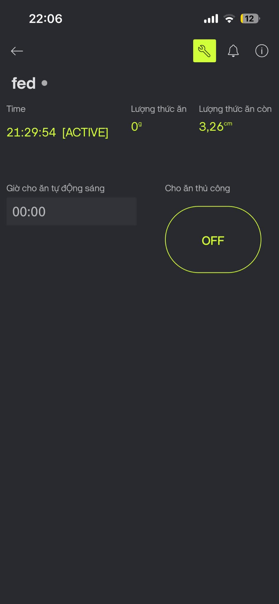

# IoT Automatic Cat Feeding System

<p align="center">


</p>

An IoT-based Smart Cat Feeder built using ESP32 DevKit V1. The system automatically dispenses food based on a predefined schedule or manual commands through the Blynk mobile application. It also monitors food level and dispensed weight while reducing power consumption using Deep Sleep Mode.

---

## Features

- Automatic scheduled feeding
- Manual feeding from mobile application
- Wi-Fi remote control
- Food weight measurement
- Food level monitoring
- Deep Sleep power saving
- RTC-based accurate scheduling

---

## Hardware Components

| Component | Function |
|------------|----------|
| ESP32 DevKit V1 | Main controller |
| TowerPro SG90 Servo | Food dispensing |
| SRF05 Ultrasonic Sensor | Food level detection |
| HX711 + Load Cell | Food weight measurement |
| DS3231 RTC Module | Accurate timekeeping |
| Breadboard | Circuit assembly |
| Jumper Wires | Connections |

---

## Software

- Arduino IDE
- ESP32 Board Package
- Blynk Mobile App

### Libraries

- WiFi.h
- BlynkSimpleEsp32.h
- ESP32Servo.h
- Wire.h
- RTClib.h
- HX711.h

---

## System Architecture

User
↓

Blynk Mobile App
↓

Wi-Fi

↓

ESP32 DevKit V1

├── Servo SG90

├── HX711 + Load Cell

├── SRF05 Ultrasonic

├── DS3231 RTC


---

## Working Principle

1. User configures feeding schedule through Blynk.
2. ESP32 synchronizes with DS3231 RTC.
3. At feeding time:
   - Servo rotates.
   - Food is dispensed.
   - Load cell measures food weight.
4. Ultrasonic sensor checks remaining food.
5. Low food notification is sent if necessary.
6. ESP32 enters Deep Sleep to reduce power consumption.

---

## Folder Structure

firmware/
Arduino source code

hardware/
Circuit and wiring diagrams

docs/
Project_Proposal.pdf

Presentation.pdf

User_Manual.pdf

Final_Report.pdf

images/
Project images

videos/


---

## Installation

### Install Arduino IDE

Download Arduino IDE.

### Install ESP32 Package

Boards Manager

Install

ESP32 by Espressif Systems

### Install Libraries

- Blynk
- ESP32Servo
- HX711
- RTClib

### Configure

Edit

config.h

```cpp
const char* auth[]    = BLYNK_AUTH_TOKEN;
const char* ssid []    = WIFI_SSID;
const char* password[] = WIFI_PASS;
```

Upload the program to ESP32.

---

## Demonstration

### Presentaion

https://www.canva.com/design/DAHMnJc8aKE/dVifdjigySEjK0Ijl_wDjQ/edit

### Blynk Interface




###Demo

https://drive.google.com/file/d/18lVkDNlwiYrjm8R1UlCcjwuLfza-qfJe/view
---

## Future Improvements

- Camera monitoring
- Battery backup
- Cloud database

---

## Authors

Vu Trinh Dinh

IoT Project

---

## License

MIT License
